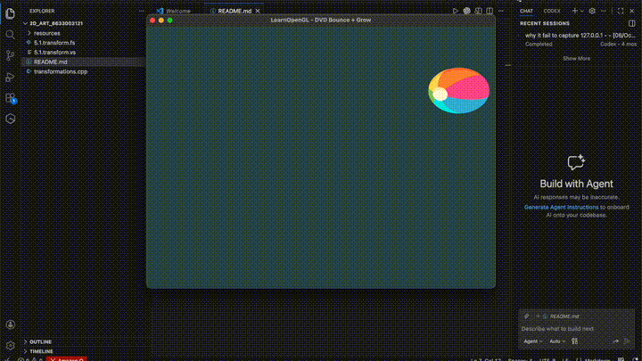

# 2D Transformation Art
This project demonstrates 2D animation using transformation matrices
(translation, rotation, scaling) based on LearnOpenGL.

## Demo Video

(Download video: [2d_art_demo.mp4](2d_art_demo.mp4))

## Description
The object moves using time-based motion logic (DVD bounce style)
and is rendered over a background image using transformation matrices.